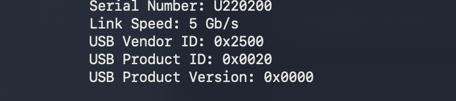
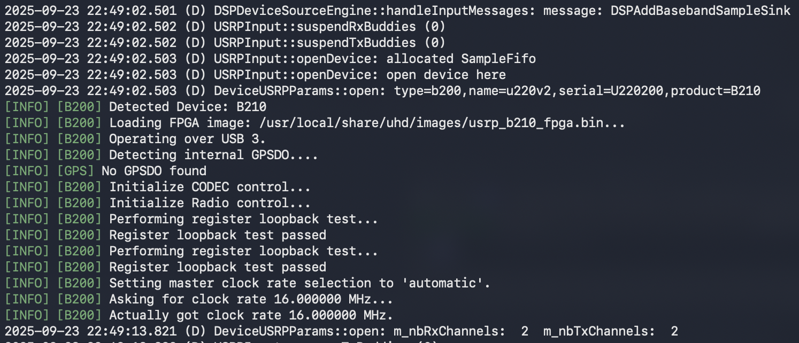

# ANTSDR-U220-UHD-MAC

This guide explains how to build and install the [AntSDR UHD fork](https://github.com/MicroPhase/antsdr_uhd), set up the required FPGA firmware, and run **SDRAngel** with the AntSDR U220 on macOS.

---

## 1. Build and Install AntSDR UHD

Clone and build the **host** component of the UHD fork:

```bash
git clone https://github.com/MicroPhase/antsdr_uhd.git
cd antsdr_uhd/host
mkdir build && cd build
````

### Install dependencies (MacPorts example)

```bash
sudo port selfupdate
sudo port install cmake boost libusb pkgconfig python311 py311-mako doxygen
```

*(If you use Homebrew instead of MacPorts, install the same packages with `brew install`.)*

### Configure & build

```bash
cmake .. -DENABLE_USB=ON \
  -DBOOST_ROOT=/opt/local \
  -DBoost_NO_BOOST_CMAKE=ON \
  -DPYTHON_EXECUTABLE=/opt/local/bin/python3.11

make -j"$(sysctl -n hw.logicalcpu)"
sudo make install
```

This installs UHD libraries into `/usr/local/lib` and UHD utilities into `/usr/local/bin`.

---

## 2. Verify USB Device Recognition

Plug in the **U220** and check it enumerates as a **USB 3.0 (SuperSpeed)** device:

Run the following:
```bash
uhd_find_devices
```
This will load the firmware image. You should see:

```bash
[INFO] [UHD] Mac OS; Clang version 17.0.0 (clang-1700.3.19.1); Boost_107600; UHD_4.1.0.0-0-45cabfde
[INFO] [B200] Loading firmware image: /usr/local/share/uhd/images/usrp_b200_fw.hex...
--------------------------------------------------
-- UHD Device 0
--------------------------------------------------
Device Address:
    serial: U220200
    name: u220v2
    product: B210
    type: b200
```
Then run:
```bash
system_profiler SPUSBDataType | grep -A5 U2
```

You should see: 


```
Serial Number: U220200
          Link Speed: 5 Gb/s
          USB Vendor ID: 0x2500
          USB Product ID: 0x0020
          USB Product Version: 0x0000

```

---

## 3. Install UHD Images Bundle

Before replacing the FPGA binary, first download the standard UHD image set:

```bash
sudo python3 /usr/local/lib/uhd/utils/uhd_images_downloader.py -i /usr/local/share/uhd/images
```

This creates `/usr/local/share/uhd/images` and fills it with the standard `.hex` and `.rbf`/`.bin` files.

---

## 4. Install FPGA Firmware for U220

The stock UHD images package includes the default B200/B210 images. For U220 to function as a B210,you must replace the FPGA binary.

1. Go to the [AntSDR UHD Releases page](https://github.com/MicroPhase/antsdr_uhd/releases).

2. Download the correct FPGA file for your board:

   * `antsdr_u220_ad9361.bin` (for AD9361 model)
   * `antsdr_u220_ad9363.bin` (for AD9363 model)

3. Rename the downloaded file to:

   ```
   usrp_b210_fpga.bin
   ```

4. Replace the file in UHD’s images directory:

```
# (Optional) back up the stock fpga file first
sudo mv /usr/local/share/uhd/images/usrp_b210_fpga.bin \
        /usr/local/share/uhd/images/usrp_b210_fpga.bin.bak

# Then copy in the U220-specific one
sudo cp ~/Downloads/usrp_b210_fpga.bin /usr/local/share/uhd/images/usrp_b210_fpga.bin
```

Now UHD will load the U220’s custom FPGA image instead of the stock B210 bitstream.

---

## 5. Create a Launcher for SDRAngel

Make a `.command` script so SDRAngel can find UHD and its images:

```bash
cat > ~/Desktop/Launch-SDRAngel.command <<'SH'
#!/bin/zsh
# UHD library path
export DYLD_LIBRARY_PATH="/usr/local/lib:${DYLD_LIBRARY_PATH}"

# UHD images directory
export UHD_IMAGES_DIR="/usr/local/share/uhd/images"

# Launch SDRAngel
exec "/Applications/SDRAngel.app/Contents/MacOS/sdrangel"
SH

chmod +x ~/Desktop/Launch-SDRAngel.command
xattr -d com.apple.quarantine ~/Desktop/Launch-SDRAngel.command 2>/dev/null || true
```

Double-click **Launch-SDRAngel.command** to start SDRAngel with UHD correctly configured.

---

## 6. Run and Confirm

1. Launch SDRAngel using the `.command` file.

2. In the Terminal window, you should see:

   ```
   Successfully loaded usrp_b200_fw.hex
   ```

   → This means the USB firmware loaded correctly.

3. In SDRAngel’s device drop-down, select the **U220**.

4. The Terminal log should then show:

   ```
   Loading usrp_b210_fpga.bin
   ```


   → This confirms the FPGA bitstream loaded.

---

## 6. SDRAngel Setup

Refer to the official [AntSDR U220 Reference Manual](https://antsdr-docs.microphase.cn/en/latest/device_and_usage_manual/ANTSDR_U_Series_Module/ANTSDR_U220_Reference_Manual/AntsdrU220_Unpacking_examination.html) for details on configuring the device inside SDRAngel once UHD reports that the firmware has loaded.

---

